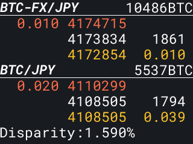

# m5_display_ticker_bitflyer
M5Stack Basic/Core2 にBitflyerティッカーを表示する




## 使い方

プロビジョニングツール`ESP BLE Provisioning`([Android](https://play.google.com/store/apps/details?id=com.espressif.provble)/[iOS](https://apps.apple.com/in/app/esp-ble-provisioning/id1473590141))をスマートフォンにインストールし、M5Stackに表示されるQRコードを読み取りWiFi設定を行ってください。

WiFi接続に成功するとティッカー情報が表示されます。

WiFi設定をやり直したい場合、左端のボタンを長押し（Basci）または左端の赤〇をしばらくタッチ（Core2）してください。M5Stackに保存されたWiFi設定がクリアされ再度QRコードが表示されます。

## ビルド環境

[arduino-cli](https://arduino.github.io/arduino-cli/0.19/installation/)をインストールする。

```sh
$ curl -fsSL https://raw.githubusercontent.com/arduino/arduino-cli/master/install.sh | BINDIR=~/.local/bin sh
```
初期設定ファイルを作成する。
```sh
$ arduino-cli config init
Config file written to: ~/.arduino15/arduino-cli.yaml
```
ボードマネージャのURLを追加する。
```
$ arduino-cli config add board_manager.additional_urls https://m5stack.oss-cn-shenzhen.aliyuncs.com/resource/arduino/package_m5stack_index.json
```
`M5Stack`用コアをインストールする。
```sh
$ arduino-cli core update-index
$ arduino-cli core install m5stack:esp32
$ arduino-cli core list
ID             Installed Latest Name
m5stack:esp32  2.0.2     2.0.2  M5Stack
```
`M5Core2`ライブラリをインストールする。
```sh
$ arduino-cli lib install --no-deps M5Core2@0.0.6
```
`M5Stack`ライブラリをインストールする。
```sh
$ arduino-cli lib install M5Stack
```
`ArduinoJson`ライブラリをインストールする。
```sh
$ arduino-cli lib install ArduinoJson
```
`ArduinoWebsockets`ライブラリをインストールする。
```sh
$ arduino-cli lib install ArduinoWebsockets
```
`spiffsgen.py`をダウンロードする。
```sh
$ wget https://raw.githubusercontent.com/espressif/esp-idf/d95b15c55740b417d1a935ac006dba4cfaeef3cf/components/spiffs/spiffsgen.py
```

## ビルドと書き込み

### M5Stack Basic (No OTA)
```sh
$ ./spiffsgen.py 2031616 data/ data_Basic.spiffs.bin
$ python ~/.arduino15/packages/m5stack/tools/esptool_py/3.1.0/esptool.py --chip esp32 --port "/dev/ttyS8" --baud 921600  --before default_reset --after hard_reset write_flash -z --flash_mode dio --flash_freq 80m --flash_size detect 0x210000 data_Basic.spiffs.bin
$ arduino-cli compile -b m5stack:esp32:m5stack-core-esp32 -v --build-property build.partitions=no_ota --build-property upload.maximum_size=2097152
$ arduino-cli upload  -b m5stack:esp32:m5stack-core-esp32 -v -p /dev/ttyS8
```

### M5Stack Core2 (Default)
```sh
$ ./spiffsgen.py 3604480 data/ data_Core2.spiffs.bin
$ python ~/.arduino15/packages/m5stack/tools/esptool_py/3.1.0/esptool.py --chip esp32 --port "/dev/ttyS9" --baud 921600  --before default_reset --after hard_reset write_flash -z --flash_mode dio --flash_freq 80m --flash_size detect 0xc90000 data_Core2.spiffs.bin
$ arduino-cli compile -b m5stack:esp32:m5stack-core2 -v
$ arduino-cli upload  -b m5stack:esp32:m5stack-core2 -v -p /dev/ttyS9
```

## リリースファイル作成

M5Stack Basic用バイナリを`release/basic`ディレクトリにエクスポートする。
```sh
$ arduino-cli compile -b m5stack:esp32:m5stack-core-esp32 -v --output-dir release/basic --build-property build.partitions=no_ota --build-property  upload.maximum_size=2097152
$ cp data_Basic.spiffs.bin release/basic/data.spiffs.bin
$ cp ~/.arduino15/packages/m5stack/hardware/esp32/2.0.2/tools/partitions/boot_app0.bin release/basic/boot_app0.bin
$ rm release/basic/*.map release/basic/*.elf
```

M5Stack Core2用バイナリを`release/core2`ディレクトリにエクスポートする。
```sh
$ arduino-cli compile -b m5stack:esp32:m5stack-core2 -v --output-dir release/core2
$ cp data_Core2.spiffs.bin release/core2/data.spiffs.bin
$ cp ~/.arduino15/packages/m5stack/hardware/esp32/2.0.2/tools/partitions/boot_app0.bin release/core2/boot_app0.bin
$ rm release/core2/*.map release/core2/*.elf
```

`zip`で固める。
```sh
$ cd release
$ zip -r ../packages/m5_display_ticker_bitflyer_for_m5stack.zip *
```
